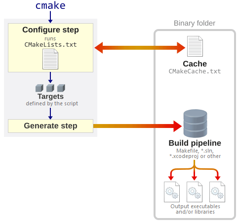

- [报告一 正则表达式与GCC编译选项技术报告](#报告一-正则表达式与gcc编译选项技术报告)
  - [摘要](#摘要)
  - [引言](#引言)
  - [一、正则表达式](#一正则表达式)
    - [1.1 正则表达式的背景](#11-正则表达式的背景)
    - [1.2 正则表达式的概念](#12-正则表达式的概念)
    - [1.3 正则表达式的功能](#13-正则表达式的功能)
    - [1.4 正则表达式的的语法](#14-正则表达式的的语法)
      - [1.4.1 正则表达式的组成](#141-正则表达式的组成)
      - [1.4.2 正则表达式的修饰符](#142-正则表达式的修饰符)
      - [1.4.3 正则表达式的运算符优先级](#143-正则表达式的运算符优先级)
      - [1.4.4 正则表达式的运算符的匹配规则](#144-正则表达式的运算符的匹配规则)
    - [1.5 当下主流正则表达式版本及应用场景](#15-当下主流正则表达式版本及应用场景)
      - [1.5.1 主流版本](#151-主流版本)
      - [1.5.2 正则表达式的应用](#152-正则表达式的应用)
    - [1.6正则表达式的演进趋势与挑战](#16正则表达式的演进趋势与挑战)
      - [1.6.1 标准化与兼容性](#161-标准化与兼容性)
      - [1.6.2 性能与安全](#162-性能与安全)
  - [二、 GCC编译选项技术](#二-gcc编译选项技术)
    - [2.1 GCC简介](#21-gcc简介)
    - [2.2 GCC在执行编译工作时的步骤](#22-gcc在执行编译工作时的步骤)
    - [2.3 GCC编译选项解释](#23-gcc编译选项解释)
      - [2.3.1 编译选项详解](#231-编译选项详解)
      - [2.3.2 优化选项解释：](#232-优化选项解释)
      - [2.3.3 调试与诊断：](#233-调试与诊断)
    - [2.4 当前流行的GCC版本](#24-当前流行的gcc版本)
  - [三、 总结](#三-总结)
  - [参考文献](#参考文献)
- [报告二  版本管理git 使用技术报告](#报告二--版本管理git-使用技术报告)
  - [摘要](#摘要-1)
  - [引言](#引言-1)
  - [一、版本管理](#一版本管理)
    - [1.1 版本控制的简介](#11-版本控制的简介)
      - [1.1.1 版本控制的目标](#111-版本控制的目标)
      - [1.1.2 版本控制的常见工具](#112-版本控制的常见工具)
    - [1.2 版本管理的优势](#12-版本管理的优势)
    - [1.3 版本管理的障碍](#13-版本管理的障碍)
  - [二、Git](#二git)
    - [2.1 Git简介](#21-git简介)
    - [2.2 Git 的核心特性](#22-git-的核心特性)
      - [2.2.1 分支与合并（Branching and Merging）](#221-分支与合并branching-and-merging)
      - [2.2.2 小而快（Small and Fast）](#222-小而快small-and-fast)
      - [2.2.3 分布式（Distributed）](#223-分布式distributed)
      - [2.2.4 数据保障（Data Assurance）](#224-数据保障data-assurance)
    - [2.2.5 暂存区（Staging Area）](#225-暂存区staging-area)
    - [2.2.6 免费和开源（Free and Poen Source）](#226-免费和开源free-and-poen-source)
    - [2.3 Git 使用](#23-git-使用)
    - [2.4 Git 应用](#24-git-应用)
  - [三、 总结](#三-总结-1)
  - [参考文献](#参考文献-1)
- [报告三 make 和 cmake 使用技术报告](#报告三-make-和-cmake-使用技术报告)
  - [摘要](#摘要-2)
  - [引言](#引言-2)
  - [一、 Make](#一-make)
    - [1.1 Make 简介](#11-make-简介)
    - [1.2 Make 技术细节](#12-make-技术细节)
      - [1.2.1 Makefile 文件](#121-makefile-文件)
      - [1.2.2 依赖分析](#122-依赖分析)
      - [1.2.3 变量定义和使用](#123-变量定义和使用)
    - [1.3 Make 使用方式](#13-make-使用方式)
      - [1.3.1 创建 Makefile 文件:](#131-创建-makefile-文件)
    - [1.3.2 运行Make命令](#132-运行make命令)
    - [1.4 Make 使用命令](#14-make-使用命令)
    - [1.5 Make 常见应用](#15-make-常见应用)
      - [1.5.1 小型项目构建](#151-小型项目构建)
      - [1.5.2 自动化编译流程](#152-自动化编译流程)
      - [1.5.3 项目维护和版本更新](#153-项目维护和版本更新)
  - [二、 CMake](#二-cmake)
    - [2.1 CMake 简介](#21-cmake-简介)
    - [2.2 CMake 技术细节](#22-cmake-技术细节)
      - [2.2.1 CMakeLists.txt 文件](#221-cmakeliststxt-文件)
      - [2.2.2 跨平台构建](#222-跨平台构建)
      - [2.2.3 模块化和函数支持](#223-模块化和函数支持)
      - [2.2.4 依赖管理](#224-依赖管理)
    - [2.3 CMake 技术细节](#23-cmake-技术细节)
      - [2.3.1 创建 CMakeLists.txt 文件](#231-创建-cmakeliststxt-文件)
      - [2.3.2 运行 CMake 命令生成构建系统](#232-运行-cmake-命令生成构建系统)
      - [2.3.3 使用生成的构建系统进行构建](#233-使用生成的构建系统进行构建)
    - [2.4 CMake 构建流程](#24-cmake-构建流程)
    - [2.5 CMake 使用命令](#25-cmake-使用命令)
    - [2.6 CMake 常见应用](#26-cmake-常见应用)
      - [2.6.1 大型跨平台项目构建](#261-大型跨平台项目构建)
      - [2.6.2 项目配置和选项管理](#262-项目配置和选项管理)
      - [2.6.3 集成外部库和工具](#263-集成外部库和工具)
  - [三、 Make 与 CMake 的比较](#三-make-与-cmake-的比较)
    - [3.1 角色和功能](#31-角色和功能)
    - [3.2 跨平台能力](#32-跨平台能力)
    - [3.3 易用性和灵活性](#33-易用性和灵活性)
    - [3.4 生成的文件类型](#34-生成的文件类型)
    - [3.5 依赖管理](#35-依赖管理)
  - [四、 Make 和 CMake 的优势](#四-make-和-cmake-的优势)
    - [4.1 Make 的优势](#41-make-的优势)
    - [4.2 CMake 的优势](#42-cmake-的优势)
  - [五、 总结](#五-总结)
  - [参考文献](#参考文献-2)
- [报告四 Doxygen 使用技术报告](#报告四-doxygen-使用技术报告)
  - [摘要](#摘要-3)
  - [引言](#引言-3)
  - [一、 Doxygen 介绍](#一-doxygen-介绍)
  - [二、Doxygen 的技术](#二doxygen-的技术)
  - [三、Doxygen 的使用](#三doxygen-的使用)
    - [3.1 使用Doxywizard进行配置](#31-使用doxywizard进行配置)
    - [3.2 关键配置选项](#32-关键配置选项)
    - [3.3 注释规范](#33-注释规范)
    - [3.4 注释规范详解](#34-注释规范详解)
    - [3.5 Doxygen生成文档](#35-doxygen生成文档)
  - [四、Doxygen的常见应用](#四doxygen的常见应用)
  - [五、 Doxygen 的优势](#五-doxygen-的优势)
  - [六、总结](#六总结)
  - [参考文献](#参考文献-3)
---


# 报告一 正则表达式与GCC编译选项技术报告
**郭瀚遥¹** 

¹（计算机学院 特软二班2023302101138）

## 摘要  
本文主要研究了正则表达式与GCC编译选项技术。正则表达式是一种通过特定语法规则描述字符串模式的工具，广泛应用于文本处理、数据验证、自动化测试等领域。文章详细介绍了正则表达式的背景、概念、功能、语法及其主流版本和应用场景，并探讨了其演进趋势与挑战。在GCC编译选项技术方面，本文阐述了GCC的基本情况、编译步骤以及各类编译选项的详细解释，并分析了当前流行的GCC版本。

**关键词**：正则表达式；GCC编译选项；

## 引言

正则表达式是一种强大的文本处理工具，是基于字符串的模式描述，可用于快速匹配文本模式，广泛应用于文本分析、数据验证和信息提取等领域。 GCC（GNU Compiler Collection）是GNU项目提供的一个功能强大、高度可定制的编译器套件，其编译选项丰富多样，可有效控制程序的编译过程，包括警告级别、优化策略、代码生成方式等。它不仅支持多种编程语言的编译，还能通过特定的编译选项实现代码的优化与调试，是开源软件开发领域的核心工具之一。

## 一、正则表达式  
### 1.1 正则表达式的背景 
正则表达式起源与20世纪40年代，神经生理学家通过数学模型描述神经元行为，奠定模式匹配基础。50年代数学家Kleene系统化定义正则表达式。1960年代，Ken Thompson将其引入计算机领域，开发编辑器和grep工具提升文本处理效率。1980年代，POSIX规范统一正则语法，分为基本和扩展两类。1990年代，Perl语言引入强大正则功能，衍生出PCRE，成为现代编程语言的主流标准。

### 1.2 正则表达式的概念
正则表达式是一种通过特定语法规则描述字符串模式的工具，用于匹配、替换或提取文本中的目标内容。其本质是“规则字符串”，定义字符组合的逻辑过滤条件。
### 1.3 正则表达式的功能
-替换与分割：按规则修改或差分字符串，如格式化日期、清理数据。
-查找：定位特定模式的子串，如日志中的错误代码。
-验证：检查字符串是否符合所定义的规则，如邮箱、手机号格式。

### 1.4 正则表达式的的语法
#### 1.4.1 正则表达式的组成
正则表达式有两种基本字符类型组成：元字符和普通字符。元字符即指在正则表达式中具有特殊含义的字符，如. \ + * ? [ ] ^ $ | 等。普通字符则指除元字符之外的所有字符。

(1) 普通字符：

普通字符包括没有显示指定为元字符的所有可打印和不可打印字符。即包括所有大写字母、小写字母、数字、标点符号和空格、制表符、换行符、回车符、换页符、回车换行符等其他符号。

| 字符   | 描述                              |
| ------ | --------------------------------- |
| [ABC]  | 匹配[...]中的所有字符             |
| [^ABC] | 匹配除[...]中的字符之外的所有字符 |
| [A-Z]  | 匹配[A-Z]中的任意字符             |
| [a-z]  | 匹配[a-z]中的任意字符             |
| [0-9]  | 匹配[0-9]中的任意字符             |
| .      | 匹配任意字符，除了换行符          |
| \d     | 匹配任意数字                      |
| \w     | 匹配任意字母、数字、下划线        |
| \s     | 匹配任意空白字符，包括换行符      |
| \S     | 匹配任意非空白字符，不包括换行符  |

非打印字符：

下标展示了非打印字符的转义序列
| 字符 | 描述                                                                                              |
| ---- | ------------------------------------------------------------------------------------------------- |
| \cx  | 匹配由x指明的控制字符（x必须为A-Z或a-z），否则视为原义'c'字符。例如\cM匹配Control-M或回车符       |
| \f   | 匹配换页符，等价于\x0c和\cL                                                                       |
| \n   | 匹配换行符，等价于\x0a和\cJ                                                                       |
| \r   | 匹配回车符，等价于\x0d和\cM                                                                       |
| \s   | 匹配任何空白字符（包括空格、制表符等），等价于[\f\n\r\t\v]。注意Unicode正则表达式会匹配全角空格符 |
| \S   | 匹配任何非空白字符，等价于[^\f\n\r\t\v]                                                           |
| \t   | 匹配制表符，等价于\x09和\cI                                                                       |
| \v   | 匹配垂直制表符，等价于\x0b和\cK                                                                   |

(2) 特殊字符

许多元字符要求在试图匹配它们时特别对待，若要匹配元字符本身，则需要使用转义序列。

| 特殊字符 | 描述                                                                                                                                                 |
| -------- | ---------------------------------------------------------------------------------------------------------------------------------------------------- |
| $        | 匹配输入字符串的结尾位置。如果设置了 RegExp 对象的 Multiline 属性，则 $ 也匹配 '\n' 或 '\r'。要匹配 $ 字符本身，使用 \ $。                           |
| ( )      | 标记一个子表达式的开始和结束位置。子表达式可以获取供以后使用。要匹配这些字符，请使用 \ ( 和 \ )。                                                    |
| *        | 匹配前面的子表达式零次或多次。要匹配 * 字符，使用 \ *。                                                                                              |
| +        | 匹配前面的子表达式一次或多次。要匹配 + 字符，使用 \ +。                                                                                              |
| .        | 匹配除换行符 \n 之外的任何单字符。要匹配 . ，使用 \ .。                                                                                              |
| [        | 标记一个中括号表达式的开始。要匹配 [，使用 \ [。                                                                                                     |
| ?        | 匹配前面的子表达式零次或一次，或指明一个非贪婪限定符。要匹配 ? 字符，使用 \ ?。                                                                      |
| \        | 将下一个字符标记为一个特殊字符、或一个原义字符、或一个向后引用、或一个八进制转义符。例如，'n' 匹配字符 'n'。'\n' 匹配换行符。序列 '\\\\' 匹配 "\\"。 |
| ^        | 匹配输入字符串的开始位置，除非在方括号表达式中使用，此时它表示不接受该字符集合。要匹配 ^ 字符本身，使用 \ ^。                                        |
| {        | 标记限定符表达式的开始。要匹配 {，使用 \ {。                                                                                                         |

(3) 限定符

限定符用于指定重复次数，即一个给定的正则表达式组件必须要出现多少次才能满足匹配。

| 限定符 | 描述                                                                 |
| ------ | -------------------------------------------------------------------- |
| *      | 匹配前面的子表达式零次或多次。* 等价于 {0,}                          |
| +      | 匹配前面的子表达式一次或多次。+ 等价于 {1,}                          |
| ?      | 匹配前面的子表达式零次或一次。? 等价于 {0,1}                         |
| {n}    | 若 n 是一个非负整数，匹配确定的 n 次。                               |
| {n,}   | 若 n 是一个非负整数，则小于或等于 n 次。                             |
| {n,m}  | m 和 n 均为非负整数，其中 n <= m。请注意在逗号和两个数之间不能有空格 |


(4) 定位符
定位符用来描述字符串或单词的边界。
| 字符 | 描述                 |
| ---- | -------------------- |
| ^    | 指定字符串的开头     |
| $    | 指定字符串的结尾     |
| \b   | 描述单词的前或后边界 |
| \B   | 表示非单词边界       |


#### 1.4.2 正则表达式的修饰符
| 修饰符 | 名称                          | 描述                                                                                       | 支持语言                                              |
| ------ | ----------------------------- | ------------------------------------------------------------------------------------------ | ----------------------------------------------------- |
| i      | ignore case (忽略大小写)      | 使匹配不区分大小写                                                                         | 几乎所有正则表达式实现（JavaScript、PHP、Python等）   |
| g      | global (全局匹配)             | 查找所有匹配项，而不是在第一个匹配后停止                                                   | JavaScript、PHP等                                     |
| m      | multiline (多行模式)          | 改变 ^ 和 $ 的行为，使其匹配每行的开头和结尾，而不仅是整个字符串的开头和结尾               | JavaScript、PHP、Python、Perl等                       |
| s      | single line/dotall (单行模式) | 使点号 . 匹配包括换行符在内的所有字符。在JavaScript中称为"dotall"模式，使用 /s 修饰符      | PHP、Perl、Python(作为re.DOTALL)、JavaScript(ES2018+) |
| u      | unicode (Unicode模式)         | 启用完整的Unicode支持，正确处理UTF-16代理对和Unicode字符属性                               | JavaScript、PHP等                                     |
| y      | sticky (粘性匹配)             | 从目标字符串的当前位置开始匹配（使用lastIndex属性）。类似于^锚点，但针对的是匹配的起始位置 | JavaScript                                            |
| x      | extended (扩展模式)           | 忽略模式中的空白和注释，使正则表达式更易读                                                 | PHP、Perl、Python(作为re.VERBOSE)                     |


#### 1.4.3 正则表达式的运算符优先级

正则表达式与算术表达式非常类似：

- 相同优先级从左到右进行运算
- 不同优先级的运算先高后低

下表从最高到最低说明了各种正则表达式运算符的优先级顺序

| 运算符                      | 描述                         |
| --------------------------- | ---------------------------- |
| \                           | 转义符                       |
| (), (?:), (?=), []          | 圆括号和方括号               |
| *, +, ?, {n}, {n,}, {n,m}   | 限定符                       |
| ^, $, \任何元字符、任何字符 | 定位点和序列(即: 位置和顺序) |
| \|                          | 替换,"或"操作                |

*不同表达式运算符的优先级顺序*

#### 1.4.4 正则表达式的运算符的匹配规则
(1) 基本模式匹配

模式，是正则表达式中最近本的元素，是一组描述字符串特征的字符，如 once 可以匹配一个包含once的字符串。

(2) 字符簇

一种更自由的描述模式的方法。如所有的元音字符的字符簇为[AaEeIiOoUu]。

PHP的正则表达式中有一些内置的通用字符簇。如下表所示：
| 字符簇       | 描述                                |
| ------------ | ----------------------------------- |
| [[:alpha:]]  | 任何字母                            |
| [[:digit:]]  | 任何数字                            |
| [[:alnum:]]  | 任何字母和数字                      |
| [[:space:]]  | 任何空白字符                        |
| [[:upper:]]  | 任何大写字母                        |
| [[:lower:]]  | 任何小写字母                        |
| [[:punct:]]  | 任何标点符号                        |
| [[:xdigit:]] | 任何16进制的数字，相当于[0-9a-fA-F] |

(3) 确定重复出现

在字符或字符簇后面添加{}用来确定前面的内容重复出现的次数。如：^a{5}可以匹配aaaaa.

### 1.5 当下主流正则表达式版本及应用场景

#### 1.5.1 主流版本
| 版本                                         | 特点                                                                                                                                                                                                                                                                          | 应用场景                                                     |
| -------------------------------------------- | ----------------------------------------------------------------------------------------------------------------------------------------------------------------------------------------------------------------------------------------------------------------------------- | ------------------------------------------------------------ |
| PCRE (Perl Compatible Regular Expressions)   | 以Perl语言的正则语法为基础，支持非捕获组(?:)、零宽断言（如(?=)）、回溯控制等高级功能，语法简洁且功能强大，成为现代编程语言（如Python、PHP、JavaScript）的默认标准                                                                                                             | 复杂文本处理（如HTML解析、日志提取），需跨语言兼容的开发场景 |
| ECMAScript正则表达式                         | JavaScript标准实现，支持Unicode属性（如\p{L}匹配字母）、具名捕获组(?<name>)，但部分特性（如后行断言）兼容性需注意                                                                                                                                                             | 前端表单验证、浏览器端文本处理                               |
| POSIX（Portable Operating System Interface） | 设计强调可移植性和标准化，具有两种语法模式：<br> &ensp; 1. BRE（Basic Regular Expressions）：早期Unix工具（如grep默认）使用，需转义元字符（如\+匹配加号），功能受限。<br>&ensp; 2. ERE（Extended Regular Expressions）：支持+、?等量词直接使用，功能稍强于BRE，但仍弱于PCRE。 | Unix/Linux系统脚本开发、兼容性要求高的工具链（如sed -E）     |

#### 1.5.2 正则表达式的应用

| 应用场景             | 具体用例       | 示例                                                                        |
| -------------------- | -------------- | --------------------------------------------------------------------------- |
| 数据验证与格式化     | 表单输入校验   | 验证邮箱（/^[\w.-]+@[\w-]+\.[\w.-]+\$/）、手机号（/^1[3-9]\d{9}$/）等格式   |
|                      | 数据清洗       | 去除冗余空格（/\s+/g替换为单个空格）、过滤HTML标签（/<[^>]*>/g）            |
| 文本处理与提取       | 日志分析       | 提取错误码（如/ERR\d{3}/）、时间戳等关键信息                                |
|                      | 网络爬虫       | 从HTML中抓取URL（/href="(.*?)"/g）或特定内容                                |
| 自动化测试           | 接口响应验证   | 匹配JSON/XML中的字段格式（如日期/\d{4}-\d{2}-\d{2}/）                       |
|                      | UI元素校验     | 验证移动端按钮标签（如/(确定\|取消)/）                                      |
| 开发工具与云服务集成 | IDE插件        | VS Code、IntelliJ等支持正则搜索替换，提升代码重构效率                       |
|                      | 云服务应用     | 腾讯云日志服务（CLS）通过正则过滤日志，阿里云Tablestore使用正则转换数据类型 |
| 性能优化与安全       | 预编译正则对象 | Python中re.compile减少重复解析开销                                          |
|                      | 避免回溯爆炸   | 使用具体字符集替代.，限制量词范围                                           |

### 1.6正则表达式的演进趋势与挑战

#### 1.6.1 标准化与兼容性
1. Unicode属性匹配（如\p{Emoji}）逐渐普及，但需注意语言支持差异610。

2. 各平台对高级特性（如递归匹配）支持不一，需谨慎使用。

#### 1.6.2 性能与安全
1. JIT编译优化：PCRE库的--enable-jit选项提升匹配速度4。
2. 内存安全：AddressSanitizer检测正则处理中的缓冲区溢出4。

## 二、 GCC编译选项技术
### 2.1 GCC简介
GCC（GNU Compiler Collection）是一个开源的编译器套件，指出C、C++、Objective-C、Fortran、Ada、Go和D语言，由GNU项目开发。GCC提供了多种编译选项，用于控制编译器的行为，如优化级别、调试信息、目标平台、语言标准等。其丰富的编译选项使得GCC在各种场景下都有良好的性能表现，但同时也存在一些问题，如编译选项的兼容性、性能优化的 effectiveness、安全性等。

### 2.2 GCC在执行编译工作时的步骤
以编译C语言文件demo.c为例：

1.预处理：将.c源文件预处理为.i预处理文件。
  
  - 展开所有宏定义，并删除宏声明。
  - 处理条件编译指令，保留符合条件的代码。
  - 插入#include包含的头文件内容到源文件中。
  - 删除所有注释（如//和/* */）
  - 添加行号和文件名标识，便于调试。
  
命令：gcc -E demo.c -o demo.i

2.编译：将.i预处理文件转换为.s汇编文件。

  - 检查语法错误，如括号是否不匹配。
  - 检查语义错误，验证逻辑合理性。如变量作用域、函数参数匹配。
  - 生成中间代码，如循环展开。
  - 输出与目标架构相关的汇编指令。

命令：gcc -S demo.i -o demo.s

3.汇编：将.s汇编文件转换为.o目标文件。 

  - 将汇编指令逐行翻译为机器码指令。
  - 生成可重定位目标文件，包括代码段、数据段和符号表。
  - 保留如外部函数引用等未解析的符号，供链接阶段处理。

命令：gcc -c demo.s -o demo.o

4.链接：将.0目标文件、.a静态库文件和.so动态库文件链接为可执行文件。

  - 将函数调用与定义关联
  - 合并所有目标文件，分配运行时的内存地址。
  - 静态链接：将库代码直接嵌入可执行文件（选择-static选项后）。
  - 动态链接：运行时加载共享库（默认方式，节省内存）

命令：gcc demo.o -o demo

### 2.3 GCC编译选项解释
#### 2.3.1 编译选项详解
| 选项                  | 说明                                                      |
| --------------------- | --------------------------------------------------------- |
| -x language           | 指定源文件语言类型，忽略文件后缀名。支持c/c++/assembler等 |
| -x none               | 恢复默认的按文件后缀名识别源文件类型                      |
| -c                    | 只执行预处理、编译和汇编，生成目标文件(.o)                |
| -S                    | 只执行预处理和编译，生成汇编代码(.s)                      |
| -E                    | 只执行预处理，结果输出到标准输出                          |
| -o file               | 指定输出文件名，默认为a.out                               |
| -pipe                 | 使用管道代替临时文件进行编译阶段之间的通讯                |
| -ansi                 | 关闭GNU C特性，启用ANSI C标准特性                         |
| -fno-asm              | 禁止使用asm、inline和typeof关键字                         |
| -fno-strict-prototype | 允许不带参数的函数声明(仅g++有效)                         |
| -fthis-is-variable    | 允许this作为变量使用(C++)                                 |
| -fcond-mismatch       | 允许条件表达式第二、三操作数类型不匹配                    |
| -funsigned-char       | 将char类型设置为unsigned char                             |
| -fsigned-char         | 将char类型设置为signed char                               |
| -include file         | 包含指定头文件，相当于#include                            |
| -imacros file         | 将指定文件的宏展开到输入文件                              |
| -Dmacro=defn          | 定义宏，相当于#define                                     |
| -Umacro               | 取消宏定义，相当于#undef                                  |
| -Idir                 | 添加头文件搜索路径                                        |
| -nostdinc             | 不在标准系统目录中搜索头文件                              |
| -nostdinc++           | 不在标准系统目录中搜索C++头文件                           |
| -C                    | 预处理时保留注释                                          |
| -M                    | 生成文件依赖关系                                          |
| -MM                   | 生成文件依赖关系，忽略系统头文件                          |
| -MD                   | 生成依赖关系，保存到.d文件                                |
| -Wa,option            | 传递选项给汇编器                                          |
| -Wl,option            | 传递选项给链接器                                          |
| -l library            | 指定链接的库文件                                          |
| -L dir                | 添加库文件搜索路径                                        |
| -O0/-O1/-O2/-O3       | 代码优化级别，从无优化到最高级优化                        |
| -g                    | 生成调试信息                                              |
| -gstabs               | 生成stabs格式调试信息(不含GDB信息)                        |
| -gstabs+              | 生成stabs格式调试信息(含GDB信息)                          |
| -ggdb                 | 生成GDB可用的调试信息                                     |
| -static               | 静态链接，禁用动态库                                      |
| -shared               | 生成共享库                                                |
| -traditional          | 支持传统C语言特性                                         |

#### 2.3.2 优化选项解释：
  1. -O0（默认）：关闭优化，适用于调试阶段
  2. -O1:基础优化，删除未使用的代码等。
  3. -O2：（氧气优化）推荐级别，包含循环优化，指令调度等。
  4. -O3：（臭氧优化）最激进的优化级别，包含内联函数，常数传播等，可能会增加代码体积。
  5. -Os：（小优化）适用于小代码，如手机应用。
  6. -march=native：针对本地CPU框架优化。

#### 2.3.3 调试与诊断：
  1. -g：GDB使用，生成调试信息。
  2. -ggdb：生成更详细的GDB调试信息。
  3. -Wall：显示如未使用变量、未初始化等所有常见警告。
  4. -Wextra：显示如空语句、类型转换等额外警告。
  5. -Werror：将所有警告都转换成错误，强制修复。
  6. -fstack-protector：检测栈溢出漏洞，增强安全性。


### 2.4 当前流行的GCC版本

截止2024年，较为流行的GCC版本如下表所示：
| 版本     | 发布年份 | 状态            | 关键特性                                                                   | 主要适用领域                                                            |
| -------- | -------- | --------------- | -------------------------------------------------------------------------- | ----------------------------------------------------------------------- |
| GCC 13.2 | 2023     | 最新稳定版      | 支持C++23、C2X草案，改进静态分析（-fanalyzer），优化性能和新硬件架构适配。 | 前沿开发(C++23项目)、高性能计算、安全关键系统、科研机构、云服务基础设施 |
| GCC 12.3 | 2023     | 广泛使用        | 完善C++20支持，增强OpenMP 5.1，改进代码生成效率。                          | 企业级应用、游戏引擎开发、现代Linux发行版(Fedora 38/39、Ubuntu 23.10)   |
| GCC 11.4 | 2023     | 长期支持（LTS） | 稳定性高，支持C++20核心特性，适合企业级开发。                              | 嵌入式系统、金融低延迟系统、LTS Linux发行版(RHEL 9、Ubuntu 22.04)       |
| GCC 10.5 | 2022     | 长期支持（LTS） | 适用于嵌入式/旧系统，兼容性优先。                                          | 传统硬件支持(MIPS/PowerPC)、遗留系统维护                                |
| GCC 9.5  | 2021     | 维护模式        | 老项目兼容，部分旧硬件驱动开发依赖。                                       | 旧代码库维护、传统架构支持                                              |


## 三、 总结
正则表达式作为一种强大的文本处理工具，在现代软件开发中占据着重要地位。从简单的字符串匹配到复杂的文本分析，正则表达式为我们提供了灵活而高效的解决方案。然而，随着应用场景的不断拓展，正则表达式也面临着标准化、兼容性、性能优化和安全等方面的挑战。

GCC作为GNU项目开发的开源编译器套件，支持多种编程语言，具有丰富的编译选项。这些选项使开发者能够在不同的开发需求下灵活地控制编译过程，从代码的优化级别到调试信息的生成，从而提升程序的性能和可维护性。当前流行的GCC版本各有特点，适用于不同的开发场景和需求。

在未来的发展中，正则表达式和GCC编译选项技术都将继续演进。正则表达式将朝着更高效的性能、更强的安全性以及更好的跨平台兼容性方向发展。GCC则会不断优化其编译选项，以适应新的硬件架构和开发需求，进一步提升编译效率和代码质量。开发者需要紧跟这些技术的发展趋势，合理运用正则表达式和GCC编译选项，以应对日益复杂的软件开发挑战。


## 参考文献  
[^1]: RUNOOB.COM. Regular Expression Syntax [EB/OL]. https://www.runoob.com/regexp/regexp-syntax.html, 2023.

[^2]: RegExr.com. RegExr: Learn, Build, & Test RegEx [EB/OL]. https://regexr.com/, 2023.

[^3]: RUNOOB.COM. GCC Parameter Details [EB/OL]. https://www.runoob.com/w3cnote/gcc-parameter-detail.html, 2023.

[^4]: GNU Project. GCC, the GNU Compiler Collection [EB/OL]. https://gcc.gnu.org/, 2023.


# 报告二  版本管理git 使用技术报告
**郭瀚遥¹** 

¹（计算机学院 特软二班2023302101138）

## 摘要
在当今数字化协作开发环境中，有效的版本管理技术对于项目的顺利推进至关重要。Git 作为一种广泛应用的版本控制系统，凭借其卓越的性能和丰富的功能，已成为众多项目团队不可或缺的工具。本报告从...等方面进行全面解析。

**关键词**：版本管理；Git；核心特性；常用命令；

## 引言
版本管理（Version Control）是软件开发中的核心技术，用于追踪文件变更历史、协调多人协作、回溯代码版本及解决冲突。Git作为当今最主流的分布式版本控制系统（DVCS），通过其创新的架构设计和强大的功能集合，为软件开发团队提供了高效的代码管理解决方案。

## 一、版本管理
### 1.1 版本控制的简介
版本管理（Version Control）是一种用于追踪和管理文件变更历史的技术，广泛应用于软件开发、文档协作等领域。
#### 1.1.1 版本控制的目标
 - **记录变更**: 保存文件的修改历史，包括内容变动、作者、时间等信息。
 - **协同工作**：支持多人并行修改同一项目，避免冲突或覆盖。
 - **版本回溯**：允许随时回退到任意历史版本，修复错误或恢复数据。
#### 1.1.2 版本控制的常见工具
 - **集中式版本控制系统**（CVCS）：如SVN，依赖中央服务器存储历史记录。
 - **分布式版本控制系统**（DVCS）：如Git，每个用户拥有完整的本地仓库，支持离线操作。

### 1.2 版本管理的优势
 - **历史追溯与审计**：查看文件的所有修改记录（谁、何时、修改了什么），便于问题排查与责任追溯。
 - **团队协作高效化**：多人并行开发时，通过分支、合并机制避免代码冲突，提升协作效率。
 - **安全性与容灾**：所有变更历史均被保存，即使本地文件丢失，也可从仓库中恢复。
 - **实验性开发支持**：通过分支功能，开发者可独立测试新功能，失败后不影响主分支代码。
 - **自动化集成**：与 CI/CD（持续集成/持续交付）工具结合，实现自动化测试、部署。

### 1.3 版本管理的障碍
| 障碍类型               | 主要问题               | 解决方案                                                |
| ---------------------- | ---------------------- | ------------------------------------------------------- |
| 合并冲突               | 多人同时修改引发冲突   | 频繁同步、任务拆分                                      |
| 学习成本               | 命令复杂、概念抽象     | 使用如GitKraken等图形化工具或IDE插件简化操作            |
| 大文件与二进制文件处理 | 存储效率低、仓库臃肿   | 使用Git LFS（Large File Storage）或外部存储管理大文件。 |
| 分支管理               | 合并困难、策略混乱     | 统一分支策略（如Github Flow），定期清理过期分支         |
| 安全控制               | 敏感代码访问权限控制   | 权限管理、代码审查或使用私有仓库                        |
| 历史维护               | 记录可能被错误操作破坏 | 限制强制推送权限、定期备份重要分支                      |

## 二、Git
### 2.1 Git简介
Git 是一个免费、开源的分布式版本控制系统。由Linus Torvalds于2005年创建，最初用于高效管理Linux内核开发。其设计目的是快速、高效地处理从小型到超大型的项目，同时保持轻量化和强大的协作能力。如今，Git已成为全球开发者首选的版本控制工具，支撑着开源社区和企业开发的核心流程。

### 2.2 Git 的核心特性
#### 2.2.1 分支与合并（Branching and Merging）
Git的分支与合并功能是其作为分布式版本控制系统的核心优势之一，也是使Git从其他软件配置管理（Software Configuration Management）中脱颖而出的重要原因。

**1. 分支**

Git 分支允许开发者创建多个独立的开发线，这些分支彼此独立，互不影响。创建、合并和删除分支的操作非常快速，仅需几秒钟。这种高效的分支管理方式极大地提升了开发灵活性，具体体现在以下几个方面：

 - 摩擦力极低的上下文切换：开发者可以轻松创建一个分支来尝试新想法，进行多次提交，随时切换回其他分支应用补丁，然后再次切换回来合并变更内容。

  - 基于角色的代码线：可以设置一个分支专门存放生产环境代码，另一个分支用于集成测试代码，还有多个小分支用于日常开发工作，确保各角色代码的清晰分离。

  - 基于特性的开发流程：为每个新特性创建独立分支，方便在不同特性之间灵活切换，待特性合并到主线后可删除该分支。
  
  - 易于丢弃的实验性分支：
  创建一个分支进行实验，若发现不可行，可随时删除该分支，无需担心对其他工作产生影响，即使期间已推送其他分支也无妨。


**2. 分支的应用场景**

  - 功能开发：为每个新功能创建独立分支（如 feature/login）。

  - Bug 修复：紧急修复时创建热修复分支（如 hotfix/security）。

  - 版本发布：通过分支管理不同版本（如 release/v1.0）。

**3. 合并**

a.合并类型

| 合并类型                       | 条件                                           | 操作                                                   |
| ------------------------------ | ---------------------------------------------- | ------------------------------------------------------ |
| 快进合并（Fast-Forward Merge） | 当目标分支是当前分支的直接上游时（无分叉）     | 直接将分支指针移动到目标分支的最新提交，不生成合并提交 |
| 三方合并（Three-Way Merge）    | 当两个分支历史分叉时（存在共同祖先之外的修改） | Git 自动生成一个新的合并提交，整合两个分支的变更       |

b. 变基

变基的作用是将当前分支的提交“移植”到目标分支的最新提交之后，形成线性历史。

但需要注意的是，变基会重写提交历史，仅适用于未推送的本地分支。

**4. Git 分支与合并的优势**

  - 高效的并行开发：多人可同时在独立分支上工作，通过合并快速集成代码。

  - 降低风险：实验性代码在分支中开发，失败后可直接丢弃，不影响主分支稳定性。

  - 灵活的历史管理：支持合并提交、变基、交互式重置（git rebase -i），灵活控制提交记录。

  - 无缝协作：结合远程仓库（如 GitHub），通过 Pull Request 发起代码审查与自动化测试。

#### 2.2.2 小而快（Small and Fast）
Git具备卓越的执行效率，Git的几乎所有操作均在本地完成，这种本地化处理机制使Git相比需要持续与远程服务器通信的集中式版本控制系统具有显著的性能优势。

Git最初为Linux内核开发设计，这要求其从初始版本就必须具备高效管理大规模代码仓库的能力。系统核心采用C语言实现，有效规避了Python等高级语言运行时环境带来的额外性能损耗。自项目创立之初，执行速度与系统性能就被确立为Git架构设计的主要设计目标。

**1. 轻量化与智能压缩**

a. 基于快照的存储模型

Git 以快照（Snapshot）为核心存储机制，每次提交记录项目文件的完整状态，而非传统工具（如 SVN）的增量差异（Delta）。但通过以下优化，Git 避免了存储冗余：

  - 内容寻址与哈希重用：文件内容通过 SHA-1 哈希生成唯一标识（未来可能升级为 SHA-256），相同内容的文件仅存储一次，即使文件名不同。

  - 对象压缩：未压缩的 Git 对象（Blob、Tree、Commit）会通过 git gc 命令打包为 .pack 文件，显著减少存储空间。例如，克隆远程仓库时传输的是压缩后的数据，本地解压还原完整历史。

b. 高效处理大文件与历史清理

  - Git LFS（大文件存储）：通过外链管理大文件（如视频、二进制文件），避免仓库膨胀。

  - 垃圾回收：定期运行 git gc 清理孤立对象（如未引用的提交），保持仓库精简。

c.与传统工具对比

SVN 等系统因增量存储需频繁重建文件，而 Git 的快照+哈希机制在存储效率上更优，尤其适合频繁修改的小文件场景。

**2. 极致优化与本地化设计**

a. 轻量级分支与快速切换

  - 分支即指针：创建分支仅需生成一个指向提交的指针，耗时几乎为零（如 git branch feature），无需复制文件。

  - 本地化操作：所有分支、提交历史存储在本地，无需网络请求即可完成提交、合并等操作，显著提升响应速度

b. 高效的提交与合并

  - 暂存区（Staging Area）：允许选择性提交部分修改，减少无效数据处理。

  - 快照比对：合并时直接对比快照哈希，仅处理差异部分，而非逐行扫描文件26。

  - Fast-Forward 合并：若目标分支无新提交，直接移动指针完成合并，无需生成新提交

c. 分布式架构的优势

  - 离线支持：本地仓库包含完整历史，提交、分支操作不受网络延迟影响。

  - 并行开发：多人协作时，各开发者独立操作本地仓库，冲突概率降低

**3. 性能对比**

通过与 Subversion（SVN）的对比测试，Git 的性能优势得到了直观的体现。测试在相同的硬件环境下进行，结果显示在多个常见操作中，Git 的速度通常是 SVN 的数倍甚至数十倍。例如，在提交文件、比较文件差异、查看提交日志等操作中，Git 的速度远超 SVN，即使在最佳情况下也是如此。

Git 有一个较慢的场景是初始克隆（clone）操作。这是因为 Git 会下载完整的版本历史记录，而非仅获取最新版本。但对于一个只需执行一次的操作而言，这种速度差异并不算特别明显。

#### 2.2.3 分布式（Distributed）
任何分布式版本控制系统(包括Git)最出色的特性之一就是其分布式本质。这意味着使用者不需要像传统集中式系统那样仅对源代码的最新版本进行"检出"(checkout)，而是可以完整"克隆"(clone)整个代码仓库。这种设计带来了一下三项关键优势

  1. 完整的数据备份：每个开发者的工作站都保存了仓库的完整副本。这意味着即使中央服务器发生故障，任何开发者的本地副本都可以作为备份来恢复数据，确保数据的安全性和可靠性。

  2. 离线工作能力：开发者可以在没有网络连接的情况下进行大部分操作，如提交、查看历史记录和创建分支。只有在需要与远程仓库同步时，才需要网络连接。

  3. 支持多种工作流程：Git 的分布式特性使得团队可以根据项目需求和团队规模选择不同的协作模式，如集中式工作流、集成经理工作流和独裁者与副手工作流。

**1. 分布式 Git 工作流程**
<!-- 集中式工作流：这是一种常见的工作方式，特别是在从集中式系统迁移过来的团队中。所有开发者都从中央仓库拉取和推送代码。Git 的机制确保了推送时的冲突检测，使得这种工作方式在集中式环境中也能正常运行。
集成经理工作流：在该模式中，一个集成经理负责管理主仓库。其他开发者从主仓库克隆代码，在自己的仓库中进行开发，然后请求集成经理拉取他们的更改。这种方式常见于开源项目或 GitHub 仓库。
独裁者与副手工作流：对于大型项目，如 Linux 内核，采用这种工作模式。一些经验丰富的开发者（副手）负责特定子系统的开发，他们合并与该子系统相关的所有更改。然后，一个主要的集成者（独裁者）从副手那里拉取更改并推送到主仓库，供其他开发者再次克隆。 -->
| 工作流类型         | 特点                                                                         | 适用场景                                      | 优势                                               |
| ------------------ | ---------------------------------------------------------------------------- | --------------------------------------------- | -------------------------------------------------- |
| 集中式工作流       | • 所有开发者直接与中央仓库交互<br>• 类似SVN的工作方式<br>• 使用单一主分支    | • 小型团队<br>• 从SVN迁移的团队<br>• 简单项目 | • 简单直观<br>• 易于管理<br>• 学习成本低           |
| 集成经理工作流     | • 设有专门的集成管理员<br>• 开发者通过fork方式参与<br>• 使用Pull Request机制 | • 开源项目<br>• GitHub项目<br>• 中等规模团队  | • 代码审查便捷<br>• 质量控制严格<br>• 社区参与度高 |
| 独裁者与副手工作流 | • 分层管理结构<br>• 子系统负责人制<br>• 严格的代码审查流程                   | • 大型项目<br>• Linux内核<br>• 复杂系统       | • 细粒度管理<br>• 高度可控<br>• 适合大规模协作     |

**2. 应用场景**

a. 跨地域团队协作：分布式架构支持异步开发，适应时区差异与网络不稳定环境
  
b. 开源项目维护：通过 Fork-PR 模型吸引全球贡献者，促进社区生态发展

#### 2.2.4 数据保障（Data Assurance）

在软件开发过程中，代码数据的完整性和安全性至关重要。Git 作为一种分布式版本控制系统，其数据保障机制能够确保项目数据的准确性和可靠性。这一特性对于团队协作和项目长期维护具有重要意义。

**1. Git的数据保障机制**

a. 核心原理

Git 的数据模型通过使用校验和（checksum）来确保每个文件和提交的完整性。每个文件和提交在存储时都会生成一个唯一的哈希值（通常使用 SHA-1 算法），这个哈希值作为对象的标识符。当文件或提交被检索时，Git 会重新计算校验和，确保检索到的内容与存储时的内容完全一致。

b. 不可篡改性

Git 的数据结构具有不可篡改的特性。一旦某个文件或提交被存储并生成了哈希值，任何对该文件或提交的更改都会导致哈希值的变化。这意味着：
  - 如果有人修改了文件内容、提交消息、日期等任何信息，整个历史记录中的相关哈希值都会发生变化。
  - 如果你有一个提交的 ID，你可以确信这个提交以及其所有历史记录都没有被篡改过。

**2. 数据保障机制的对比**


大多数集中式版本控制系统（如 Subversion）默认不提供这样的完整性校验机制。在这些系统中，文件的存储和检索通常依赖于服务器端的管理，客户端无法轻松验证数据的完整性和正确性。

| 特性       | Git (分布式)                             | SVN/CVS (集中式)                     |
| ---------- | ---------------------------------------- | ------------------------------------ |
| 数据完整性 | 通过校验和校验内容，任何更改都可即时检测 | 在数据服务器端校验，本地无完整性验证 |
| 备灾能力   | 多节点冗余，无单点故障风险               | 中央服务器故障时可能导致数据丢失     |
| 历史记录   | 不可逆更改记录，支持完整版本及回溯       | 历史记录可能被篡改或修改             |
| 离线操作   | 支持完整本地提交与分支管理               | 依赖网络连接                         |


### 2.2.5 暂存区（Staging Area）

Git 的暂存区（Staging Area）是其区别于其他版本控制系统的一个重要特性。暂存区提供了一个灵活的机制，使开发者能够在提交之前对变更内容进行精细的控制和审查。这一特性在代码管理和团队协作中具有重要作用。

**1. 定义与功能**

Git 的暂存区是一个中间区域，用于暂存即将提交的文件变更。与直接提交所有修改的不同，Git 允许开发者在提交之前将部分修改放入暂存区，从而实现对提交内容的精细控制。

**2. 独特优势**

| 优势特性         | 说明                                                                                                                                                                                                               |
| ---------------- | ------------------------------------------------------------------------------------------------------------------------------------------------------------------------------------------------------------------ |
| 快速暂存部分文件 | 用户可以有选择地将工作目录中的特定文件变更暂存，而无需一次性提交所有修改文件，也无需在提交命令中逐个列出文件路径                                                                                                   |
| 细粒度变更控制   | 支持仅暂存单个文件中的部分修改内容。这完美解决了以下场景：<br>• 过去当用户对文件进行多个逻辑无关的修改时，可能发生忘记提交其中部分修改的情况<br>• 现在用户可以将当前提交所需的变更暂存，而将其他变更保留至后续提交 |
| 扩展灵活性       | 该特性可扩展支持任意数量的文件修改组合                                                                                                                                                                             |

**3. 暂存区的工作流程**

| 操作类型   | 说明                                             | 具体操作                                                                                             |
| ---------- | ------------------------------------------------ | ---------------------------------------------------------------------------------------------------- |
| 选择性暂存 | 开发者可以将特定文件或部分修改添加到暂存区       | • 使用 git add \<file\> 添加整个文件的修改<br>• 使用 git add -p 交互式选择文件中的特定修改块进行暂存 |
| 精细的提交 | 在暂存区中组合多个不同的修改，形成逻辑完整的提交 | • 支持将一个文件中与多个任务相关的修改分批提交<br>• 避免污染提交历史                                 |
| 忽略暂存区 | 跳过暂存区步骤直接提交修改                       | • 通过 git commit -a 命令直接提交所有已修改的文件                                                    |

**4. 暂存区的优势**

| 优势               | 说明                                                                                                                                               |
| ------------------ | -------------------------------------------------------------------------------------------------------------------------------------------------- |
| 提交内容的精确控制 | 暂存区允许开发者对提交内容进行精确控制，而无需一次性提交所有修改。这在处理复杂任务或进行部分完成的更改时特别有用。                                 |
| 支持部分文件提交   | 开发者可以对文件的部分修改进行暂存，从而在一次提交中包含一个完整的逻辑更改，即使该文件中包含多个不相关的修改。                                     |
| 灵活的工作流       | 暂存区支持多种工作流，开发者可以根据需要选择是否使用暂存区。对于简单的任务，可以直接提交所有修改；对于复杂的情况，可以利用暂存区进行精细的提交管理 |

### 2.2.6 免费和开源（Free and Poen Source）

Git 依据《GNU通用公共许可证第二版》（GNU General Public License version 2.0）发布，这是一个开源许可证。Git 项目选择使用 GPLv2 许可证，以确保用户分享和修改自由软件的自由——保障软件对其所有用户都是自由的。

然而，为避免混淆，Git 限制对 "Git" 名称及相关标识的使用。

### 2.3 Git 使用
Git 的基本使用可以分为以下几个主要方面:

| 操作类型       | 命令                           | 常用参数选项                                              | 说明                   |
| -------------- | ------------------------------ | --------------------------------------------------------- | ---------------------- |
| **仓库管理**   | `git init`                     | `--bare`: 创建裸仓库                                      | 初始化新的Git仓库      |
|                | `git clone <URL>`              | `--depth`: 指定克隆深度<br>`--branch`: 指定分支           | 克隆远程仓库到本地     |
| **提交操作**   | `git add <文件名>`             | `-p`: 交互式添加<br>`-u`: 仅添加已跟踪文件                | 添加文件到暂存区       |
|                | `git add .`                    | `-A`: 添加所有变化<br>`-n`: 演习模式                      | 添加所有修改到暂存区   |
|                | `git commit -m "说明"`         | `-a`: 自动暂存已跟踪文件<br>`--amend`: 修改上次提交       | 提交暂存的更改         |
|                | `git status`                   | `-s`: 简短输出<br>`-b`: 显示分支信息                      | 查看仓库当前状态       |
|                | `git log`                      | `--oneline`: 单行显示<br>`--graph`: 图形化显示            | 查看提交历史           |
| **分支管理**   | `git branch <分支名>`          | `-r`: 查看远程分支<br>`-a`: 查看所有分支                  | 创建新分支             |
|                | `git checkout/switch <分支名>` | `-b`: 创建并切换<br>`-t`: 跟踪远程分支                    | 切换到指定分支         |
|                | `git merge <分支名>`           | `--no-ff`: 禁用快进<br>`--squash`: 压缩提交               | 合并指定分支到当前分支 |
|                | `git branch -d <分支名>`       | `-D`: 强制删除<br>`-r`: 删除远程分支跟踪                  | 删除分支               |
| **远程协作**   | `git remote add origin <URL>`  | `-t`: 指定跟踪分支<br>`-f`: 立即获取                      | 添加远程仓库           |
|                | `git push -u origin <分支名>`  | `--force`: 强制推送<br>`--tags`: 推送标签                 | 推送到远程仓库         |
|                | `git pull origin <分支名>`     | `--rebase`: 使用变基<br>`--no-commit`: 不自动提交         | 从远程仓库拉取更新     |
|                | `git fetch origin`             | `--all`: 获取所有远程<br>`--prune`: 清理无效引用          | 获取远程仓库信息       |
| **撤销与回退** | `git restore <文件名>`         | `--staged`: 撤销暂存<br>`--source`: 指定来源              | 撤销未暂存的修改       |
|                | `git reset --hard <提交哈希>`  | `--soft`: 保留工作区<br>`--mixed`: 保留文件改动           | 回退到指定提交         |
|                | `git commit --amend`           | `--no-edit`: 不修改提交信息<br>`--reset-author`: 重置作者 | 修改最近一次提交       |
| **标签管理**   | `git tag <标签名>`             | `-a`: 创建附注标签<br>`-m`: 添加说明信息                  | 创建标签               |
|                | `git push origin --tags`       | `--follow-tags`: 推送相关标签<br>`--force`: 强制推送      | 推送所有标签到远程     |

这些命令涵盖了Git的基本使用场景，从本地仓库管理到远程协作都包含在内。在实际使用中，这些命令可以组合使用，以实现更复杂的版本控制需求。

### 2.4 Git 应用
**1. 开源项目管理**

| 项目名称   | 描述                               | Git应用场景                                                              |
| ---------- | ---------------------------------- | ------------------------------------------------------------------------ |
| Linux 内核 | 世界上最大的开源项目之一           | • 全球开发者协作开发和维护<br>• 高效管理代码变更<br>• 分布式开发模式支持 |
| React      | Facebook开发的用户界面JavaScript库 | • 开发者获取最新代码<br>• 社区贡献管理<br>• 版本发布控制                 |
| VSCode     | 微软开发的开源代码编辑器           | • 图形化Git界面操作<br>• 代码托管平台集成<br>• 团队协作管理              |
| TensorFlow | Google开发的开源机器学习框架       | • 机器学习模型代码共享<br>• 版本控制管理<br>• 社区协作开发               |
| Kubernetes | 开源容器编排平台                   | • 集群配置管理<br>• 代码版本控制<br>• 多团队协作开发                     |

**2. 代码托管平台**
| 平台名称 | 特点描述                           | 主要功能                                                                     |
| -------- | ---------------------------------- | ---------------------------------------------------------------------------- |
| GitHub   | 全球最大的代码托管平台，2008年成立 | • 代码托管服务<br>• Pull Request功能<br>• Issues问题追踪<br>• 程序员社交平台 |
| GitLab   | 支持自托管的Git仓库管理系统        | • 代码仓库管理<br>• 问题跟踪系统<br>• 持续集成功能<br>• 企业版和社区版       |
| Gitee    | 国内主流代码托管平台               | • Git仓库托管<br>• 私有/公开仓库<br>• 代码管理协作<br>• 本地化服务支持       |

## 三、 总结

在当今数字化协作开发环境中，有效的版本管理技术对于项目的顺利推进至关重要。通过本报告对 Git 的全面解析，我们可以看到 Git 凭借其卓越的性能和丰富的功能，已成为众多项目团队不可或缺的工具。它为开发者提供了灵活的分支管理、便捷的暂存区、高效的数据保障以及强大的分布式协作能力，极大地提升了软件开发的效率和质量。无论是在小型团队还是大型企业中，Git 都能有效地支持团队协作，帮助团队更好地管理代码变更、提高开发效率并降低项目风险。对于追求高效、可靠和安全的软件开发项目来说，Git 的这些核心特性和优势使其成为现代软件开发中不可或缺的版本控制系统。

## 参考文献

[1] Git. Git Documentation [EB/OL]. https://git-scm.com/, 2023.

[2] Loeliger J, McCullough M. Version Control with Git: Powerful tools and techniques for collaborative software development [M]. O'Reilly Media, 2012.

[3] 菜鸟教程. Git 教程 [EB/OL]. https://www.runoob.com/git/git-tutorial.html, 2023.


# 报告三 make 和 cmake 使用技术报告

## 摘要

**关键词**

## 引言

在软件开发过程中，构建工具起着至关重要的作用。Make 和 CMake 是两种广泛使用的构建工具，它们能够帮助开发者自动化编译、链接等构建过程，提高开发效率，确保项目的可移植性和可维护性。本报告将介绍 Make 和 CMake 的基本原理、使用方法以及在实际项目中的应用案例。

## 一、 Make
### 1.1 Make 简介

Make 是一个传统的构建工具，在类 Unix 系统中广泛使用。它依据 Makefile 文件中的规则来执行构建操作，通过分析文件之间的依赖关系，自动执行必要的命令来更新目标文件，如编译源代码生成可执行文件或库等。Make 在小型项目中简单易用，能有效简化编译流程。

### 1.2 Make 技术细节
#### 1.2.1 Makefile 文件
这是 Make 的核心配置文件，定义了构建过程中所需的规则、变量和目标。文件由目标、依赖和规则命令组成，Make 根据其内容决定如何构建项目。例如，在一个 C 语言项目中，Makefile 可指定如何编译各个源文件以及如何链接生成最终可执行文件。

#### 1.2.2 依赖分析
Make 能自动分析文件之间的依赖关系。当源文件发生变化时，它仅重新编译受影响的部分，而不是整个项目，这大大提高了构建效率。比如，若项目中有多个源文件共同生成一个目标文件，只有当相关源文件更新时，Make 才会重新编译生成该目标文件。

#### 1.2.3 变量定义和使用
支持在 Makefile 中定义变量来存储常用的路径、编译选项等信息，可在文件中重复使用这些变量，使得 Makefile 更具可读性和可维护性。例如，定义 CC 变量表示编译器，CFLAGS 表示编译选项，方便统一管理和修改。

### 1.3 Make 使用方式
#### 1.3.1 创建 Makefile 文件:

在项目根目录下创建 Makefile 文件，按照规定的语法编写构建规则。比如：
 
  ```
  CC = gcc
  CFLAGS = -Wall -g
  SRCS = main.c file1.c file2.c
  OBJS = $(SRCS:.c=.o)

  all: myprogram

  myprogram: $(OBJS)
    $(CC) $(CFLAGS) -o myprogram $(OBJS)
  ```
  在这个Makefile中，定义了编译器（CC）、编译选项（CFLAGS）、源文件列表（SRCS）、目标文件列表（OBJS）等变量，并指定了如何生成最终的可执行文件 myprogram。

### 1.3.2 运行Make命令

在终端中进入项目目录，执行 “make” 命令，Make 会自动读取并解析 Makefile 文件，按照规则执行相应的构建操作。若要使用特定的 Makefile 文件或执行特定目标，可通过命令选项来指定，如 “make -f custom_makefile target_name”。

### 1.4 Make 使用命令
| 命令           | 描述                       | 示例                      | 扩展参数           | 参数说明                                                                |
| -------------- | -------------------------- | ------------------------- | ------------------ | ----------------------------------------------------------------------- |
| make           | 执行默认目标的构建操作     | `make`                    | -                  | -                                                                       |
| make -f file   | 指定使用特定的Makefile文件 | `make -f custom_makefile` | --file=file        | 可使用--file=指定完整文件路径                                           |
| make -C dir    | 切换到指定目录执行构建     | `make -C src`             | --directory=dir    | 可使用相对或绝对路径指定目录                                            |
| make -j [jobs] | 指定并行执行的任务数       | `make -j4`                | --jobs=[N]         | 未指定N时默认使用最大可用线程数                                         |
| make -k        | 遇错继续执行其他目标       | `make -k`                 | --keep-going       | 即使某个目标失败也继续处理其他独立目标                                  |
| make -n        | 显示但不执行命令           | `make -n`                 | --just-print       | 用于调试Makefile,查看命令执行顺序                                       |
| make -s        | 静默模式，不显示执行命令   | `make -s`                 | --silent, --quiet  | 两个参数效果相同,都是不输出命令信息                                     |
| make -B        | 强制重新构建所有目标       | `make -B`                 | --always-make      | 忽略时间戳,强制重新构建所有目标                                         |
| make --version | 显示Make版本信息           | `make --version`          | -v                 | 简写形式-v与完整形式等效                                                |
| make -d        | 打印调试信息               | `make -d`                 | --debug            | 输出详细的调试信息,包括隐含规则匹配、变量扩展过程、文件时间戳检查等信息 |
| make -i        | 忽略所有错误               | `make -i`                 | --ignore-errors    | 忽略所有命令执行错误并继续执行                                          |
| make -p        | 打印数据库信息             | `make -p`                 | --print-data-base  | 显示make内部数据库,包括所有规则和变量定义                               |
| make -q        | 不执行命令,仅返回目标状态  | `make -q`                 | --question         | 检查目标是否需要更新,返回0表示已是最新                                  |
| make -r        | 禁用内置隐含规则           | `make -r`                 | --no-builtin-rules | 仅使用Makefile中明确定义的规则                                          |
| make -w        | 打印当前工作目录           | `make -w`                 | --print-directory  | 在执行命令前后显示当前工作目录                                          |
| make -l [load] | 限制系统负载阈值           | `make -l 5.0`             | --max-load=[N]     | N为系统负载阈值,超过则暂停新任务                                        |
| make -W file   | 强制将文件视为最新         | `make -W modified_file.c` | --what-if=file     | 忽略文件的实际时间戳,视为最新状态                                       |

### 1.5 Make 常见应用
#### 1.5.1 小型项目构建
在小型 C/C++ 项目中，通过简单的 Makefile 即可实现自动化编译和链接，快速生成可执行文件，方便开发者进行测试和调试。

例如，一个仅包含 main.c 和 utils.c 的项目，通过 Makefile 中的规则自动编译为 .o 文件并链接为最终程序。此方式避免了重复输入冗长的编译命令，尤其适合快速原型开发和日常调试场景。

#### 1.5.2 自动化编译流程

Make 可将编译、链接、清理等操作整合到 Makefile 中，实现一键化构建流程。

例如，定义 all 目标编译全部代码，test 目标运行单元测试，clean 目标删除中间文件。开发者只需执行 make test 即可自动完成编译并启动测试，显著提升效率。此外，结合 Shell 脚本或环境变量，还能实现动态配置（如切换调试/发布模式），减少人工干预，降低操作错误风险。

#### 1.5.3 项目维护和版本更新

当项目代码频繁迭代时，Make 的依赖追踪机制能自动检测变更文件并仅重新编译受影响的部分。

例如，若仅修改了 utils.c，则 make 仅重新生成 utils.o 并重新链接，避免全量编译的时间浪费。结合版本控制工具（如 Git），开发者可通过 Makefile 定义版本号注入、打包发布等规则，确保每次构建的一致性。此特性在长期维护的项目中尤为重要，能够有效管理代码演进和跨版本兼容性问题。

## 二、 CMake
### 2.1 CMake 简介
CMake 是一个跨平台的自动化构建系统生成器，它根据项目中的 CMakeLists.txt 文件生成对应的构建系统描述文件。如 Unix 的 Makefile、Windows 的 Visual Studio 项目文件等。CMake 具有强大的跨平台能力，能够适应不同的操作系统和编译器环境，适用于各种规模的项目，尤其在大型复杂项目中表现出色。

### 2.2 CMake 技术细节
#### 2.2.1 CMakeLists.txt 文件 
CMakeLists.txt 文件是 CMake 的核心配置文件，用于描述项目的构建规则、源文件、目标文件、依赖库等信息。它采用脚本语言编写，提供了丰富的命令和函数，可灵活定义项目的构建逻辑。

例如，可指定项目的名称、版本、编译器选项、源文件路径、生成的可执行文件或库的名称等。

#### 2.2.2 跨平台构建 
CMake 能在多种操作系统（如 Windows、macOS、Linux）上使用相同的 CMakeLists.txt 文件生成适合该平台的构建系统描述文件，实现项目的跨平台构建，大大减少了因平台差异导致的配置工作量。

#### 2.2.3 模块化和函数支持

支持模块化开发，可将常用的构建逻辑封装成模块或函数，方便在多个项目中复用，提高构建脚本的可读性和可维护性。

例如，可创建自定义函数来处理特定类型的源文件或生成特定格式的输出文件。

#### 2.2.4 依赖管理
CMake 提供了内置机制来自动检测和配置项目依赖的外部库，包括查找库文件、头文件路径以及处理版本兼容性等问题。它可通过包管理器或自定义查找模块来定位所需的依赖库，并将其正确地链接到项目中。

### 2.3 CMake 技术细节
#### 2.3.1 创建 CMakeLists.txt 文件
在项目根目录下创建 CMakeLists.txt 文件，按照 CMake 的语法编写项目的构建规则。例如：
```
cmake_minimum_required(VERSION 3.10)
project(SimpleProject)

option(ENABLE_DEBUG "Enable debug information" OFF)
option(ENABLE_TESTS "Build tests" OFF)

if (ENABLE_DEBUG)
    set(CMAKE_CXX_FLAGS "${CMAKE_CXX_FLAGS} -g")
endif()

if (ENABLE_TESTS)
    add_subdirectory(tests)
endif()

add_executable(${PROJECT_NAME} main.cpp)
```
在这个 CMakeLists.txt 中，指定了 CMake 的最低版本要求，定义了项目名称，添加了构建选项（如是否启用调试信息和测试,这里均默认关闭），根据选项状态设置编译器选项，并最终生成可执行文件。

#### 2.3.2 运行 CMake 命令生成构建系统
在终端中进入项目目录，创建一个构建目录（如 build），进入该目录，运行 “cmake ..” 命令，CMake 会读取上级目录中的 CMakeLists.txt 文件，并生成对应的构建系统描述文件。若要传递选项覆盖默认设置，可在命令中添加 “-D” 参数，如 “cmake .. -DENABLE_DEBUG=ON -DENABLE_TESTS=ON”

#### 2.3.3 使用生成的构建系统进行构建
在生成构建系统描述文件后，根据所生成的构建系统类型，使用相应的构建工具（如 make 或 Ninja）执行构建操作。例如，若生成的是 Makefile，可直接运行 “make” 命令来编译项目。

### 2.4 CMake 构建流程

CMake 的构建流程主要包含以下几个步骤：

1. **创建构建目录**
  <br>CMake 推荐使用 “Out-of-source” 构建方式，即将构建文件放在源代码目录之外的独立目录中，以保持源代码目录的整洁。
   - 在项目根目录下创建独立的构建目录（如 build）
   - 进入刚刚创建的构建目录
   ```bash
   mkdir build
   cd build
   ```

2. **使用 CMake 生成构建文件**
   <br>在构建目录中运行 CMake，生成适合当前平台的构建系统文件，如 Makefile、Ninja 构建文件、Visual Studio 工程文件等。
   - 运行 CMake 配置命令，指定源码目录
   - 可选择生成器类型（如 Ninja、Visual Studio）
   - 可指定构建类型（Debug/Release）
   ```bash
   cmake ..  # 基本配置
   cmake -G "Ninja" ..  # 指定生成器
   cmake -DCMAKE_BUILD_TYPE=Release ..  # 指定构建类型
   ```
   - 检查配置结果，CMake 会输出配置过程中的详细信息，包括找到的库、定义的选项等，如果没有错误，构建系统文件将被生成到构建目录中。

3. **编译和构建**
  <br>根据不同构建系统，使用生成的构建文件进行编译和构建。
   - 根据生成的构建系统文件进行编译
   - 可构建整个项目或特定目标
   ```bash
   # 使用 Make
   make
   make MyExecutable  # 构建特定目标

   # 使用 Ninja
   ninja
   ninja MyExecutable  # 构建特定目标

   # 使用 Visual Studio
   msbuild MyProject.sln /p:Configuration=Release
   ```

4. **清理构建文件**
  <br>构建过程中生成的中间文件和目标文件可以通过清理操作删除。
   - 删除生成的中间文件和目标文件
   ```bash
   make clean  # Make
   ninja clean  # Ninja
   rm -rf build/*  # 手动清理
   ```

5. **重新配置和构建**
  <br>如果修改了 CMakeLists.txt 文件或项目设置，可能需要重新配置和构建项目。
   - 修改 CMakeLists.txt 后需重新配置
   - 重新运行构建命令
   ```bash
   cmake ..  # 重新配置
   make/ninja  # 重新构建根据构建系统不同选择不同的命令
   ```


### 2.5 CMake 使用命令
下表列出了 CMake 的常用命令及其功能说明：

| 命令                       | 说明                                                    |
| -------------------------- | ------------------------------------------------------- |
| cmake ..                   | 在上级目录中查找CMakeLists.txt并生成构建系统描述文件    |
| cmake -D<选项>=<值>        | 传递选项覆盖默认设置，如cmake -DENABLE_DEBUG=ON         |
| cmake --build .            | 在当前目录调用底层构建工具(如make)执行构建              |
| cmake --version            | 显示CMake版本信息                                       |
| cmake -G <生成器>          | 指定要使用的构建系统生成器，如"Unix Makefiles"或"Ninja" |
| cmake -S <源目录>          | 指定源代码目录的路径                                    |
| cmake -B <构建目录>        | 指定构建输出目录的路径                                  |
| cmake --install .          | 安装已构建的项目                                        |
| cmake --help               | 显示CMake帮助信息                                       |
| cmake --system-information | 显示系统信息和CMake配置                                 |

### 2.6 CMake 常见应用
#### 2.6.1 大型跨平台项目构建

在大型项目，尤其是需要在多个操作系统平台和编译器环境下进行开发的项目中，CMake 能有效管理复杂的构建规则和依赖关系，生成相应的构建系统文件，确保项目在不同平台上的顺利构建。

#### 2.6.2 项目配置和选项管理

通过 CMakeLists.txt 文件中的选项定义和条件判断，可根据不同的构建需求生成具有不同配置的项目版本，如调试版本、发布版本、测试版本等，方便进行针对性的开发和测试工作。

#### 2.6.3 集成外部库和工具

借助 CMake 的依赖管理功能，能够方便地将项目所需的外部库集成进来，自动处理库的查找、版本检查和链接等问题，减少手动配置外部库的工作量，提高项目的可移植性和可维护性。

## 三、 Make 与 CMake 的比较
### 3.1 角色和功能
- Make ：是一个具体的构建工具，直接根据 Makefile 文件中的规则执行编译、链接等操作来生成目标文件。
- CMake ：是一个构建系统生成器，它不直接参与编译和链接过程，而是根据 CMakeLists.txt 文件生成其他构建工具（如 Make、Ninja）所需的描述文件，由这些构建工具来完成实际的构建工作。

### 3.2 跨平台能力
- Make ：通常与特定平台相关联，虽然可以通过编写通用的 Makefile 来适应多个平台，但在不同平台上往往需要对 Makefile 进行较多的手动调整。
- CMake ：具有很强的跨平台特性，使用相同的 CMakeLists.txt 文件能够在多种操作系统上生成适合该平台的构建系统描述文件，实现真正的跨平台构建，大大减少了因平台差异带来的配置工作。

### 3.3 易用性和灵活性
- Make ：相对简单直接，适合小型项目。但对于大型项目，由于需要手动维护 Makefile 中的复杂构建规则，容易变得难以管理和维护。
- CMake ：提供了更高级的抽象和丰富的功能集，如条件语句、循环、函数定义等，使 CMakeLists.txt 文件能够以更灵活和模块化的方式编写，适应复杂项目的构建需求。

### 3.4 生成的文件类型
- Make ：生成 Makefile 文件，该文件包含了 make 程序执行构建操作所需的具体命令。
- CMake ：可生成多种类型的构建系统描述文件，如 Makefile、Ninja 构建文件、Visual Studio 解决方案 (.sln) 文件、Xcode 项目文件等，满足不同开发环境和构建工具的需求。

### 3.5 依赖管理
- Make ：依赖关系需要在 Makefile 中显式指定，开发者需要手动维护文件之间的依赖关系，容易出错且工作量较大。
- CMake ：内置了强大的依赖管理机制，能够自动检测和配置项目依赖的外部库，包括查找库文件位置、头文件路径以及处理版本兼容性等问题，简化了依赖管理的工作。

## 四、 Make 和 CMake 的优势
### 4.1 Make 的优势
| 优势类别     | 具体优势     | 说明                                                          | 应用场景         |
| ------------ | ------------ | ------------------------------------------------------------- | ---------------- |
| **简单易用** | 语法简洁     | • 语法规则直观<br>• 快速上手<br>• 无需复杂脚本语言            | 小型项目快速构建 |
|              | 易于理解     | • 构建过程直观<br>• 规则执行清晰<br>• 便于调试维护            | 项目维护和调试   |
| **依赖分析** | 自动检测依赖 | • 智能识别文件依赖<br>• 增量编译<br>• 提高构建效率            | 大型项目构建优化 |
|              | 精确构建控制 | • 控制构建顺序<br>• 避免冗余构建<br>• 保证编译链接正确性      | 复杂项目构建管理 |
| **灵活性高** | 自定义规则   | • 支持自定义构建规则<br>• 可编写shell脚本<br>• 实现个性化任务 | 特殊构建需求     |
|              | 变量函数支持 | • 丰富的内置函数<br>• 变量定义灵活<br>• 增强功能扩展性        | 复杂构建逻辑实现 |
| **应用基础** | 广泛系统支持 | • Unix/Linux默认支持<br>• 无需额外安装<br>• 使用门槛低        | 跨平台开发       |
|              | 社区资源丰富 | • 大量参考资料<br>• 活跃社区支持<br>• 问题解决便捷            | 学习和问题解决   |


### 4.2 CMake 的优势

| 优势类别       | 具体优势         | 说明                                                               | 应用场景         |
| -------------- | ---------------- | ------------------------------------------------------------------ | ---------------- |
| **跨平台能力** | 统一构建描述     | • 单一CMakeLists.txt文件<br>• 多平台通用<br>• 自动生成平台构建文件 | 跨平台项目开发   |
|                | 自动适配平台特性 | • 检测系统特性<br>• 处理平台差异<br>• 优化平台配置                 | 多平台兼容性需求 |
| **功能丰富**   | 模块化和函数支持 | • 构建逻辑封装<br>• 代码复用<br>• 提高可维护性                     | 大型复杂项目     |
|                | 强大依赖管理     | • 自动检测依赖<br>• 配置外部库<br>• 版本兼容处理                   | 多依赖项目管理   |
|                | 条件判断控制     | • 灵活构建控制<br>• 多配置支持<br>• 动态适应需求                   | 定制化构建需求   |
| **可扩展性**   | 自定义模块插件   | • 扩展功能支持<br>• 特殊需求实现<br>• 工具链集成                   | 特定功能扩展     |
|                | 工具链集成       | • 版本控制集成<br>• 测试框架支持<br>• 持续集成对接                 | 开发流程自动化   |
| **构建系统**   | 多构建工具支持   | • 生成多种构建文件<br>• 工具选择灵活<br>• 适应不同环境             | 构建工具选择     |
|                | 灵活构建选择     | • 环境适应性强<br>• 无缝切换工具<br>• 保持构建一致                 | 开发环境转换     |

## 五、 总结
Make 和 CMake 在软件开发中各有优势和适用场景。Make 对于小型项目来说简单易用，能够快速实现自动化编译和链接；而 CMake 凭借其跨平台能力、强大的功能集和灵活的构建规则定义，在大型复杂项目中表现出色，尤其适合需要在多个平台和环境下进行开发的项目。在实际开发中，开发者应根据项目的规模、复杂度、跨平台需求等因素综合考虑选择合适的构建工具，也可以结合使用两者，如先利用 CMake 生成 Makefile，再通过 make 进行构建，充分发挥各自的优势，提高项目的开发效率和可维护性。

## 参考文献

[1] Make.com. (2024). Make Product Documentation [Online]. Available: https://www.make.com/en/product

[2] Kitware Inc. (2024). CMake Contact Information [Online]. Available: https://cmake.org/contact-us/

[3] Li, K. (2024, Feb.). "CMake构建流程详解," CSDN Blog [Online]. Available: https://blog.csdn.net/LKHzzzzz/article/details/139630281

[4] RUNOOB. (2024). "CMake 构建流程," 菜鸟教程 [Online]. Available: https://www.runoob.com/cmake/cmake-build-flow.html

# 报告四 Doxygen 使用技术报告
**郭瀚遥¹** 

¹（计算机学院 特软二班2023302101138）

## 摘要
在现代软件开发中，代码文档化对项目的成功至关重要。Doxygen是一款功能强大的自动化文档生成工具，它能从源代码注释中提取信息，生成结构化文档。本文介绍了Doxygen的使用方法、技术特点及优势，旨在帮助开发者高效利用该工具，提升文档质量，促进团队协作与项目维护。Doxygen支持多种编程语言和输出格式，并提供丰富的配置选项。通过特定注释规范，开发者可生成包含类图、协作图等元素的完整文档，显著提高开发效率。

**关键词**: Doxygen；文档生成；代码注释；自动化；编程语言；

## 引言

在现代软件开发领域，代码文档化是项目成功的关键因素之一。良好的文档不仅能够帮助团队成员更好地理解和协作，还能为后续的代码维护和功能扩展提供重要支持。然而，手动编写和维护文档往往是一项耗时且容易出错的工作。Doxygen作为一款功能强大的文档生成工具，通过自动化的方式从源代码中的注释提取信息，生成结构化、格式化的文档，极大地提升了开发效率和文档质量。它不仅支持多种编程语言，还能生成多种格式的文档，并提供丰富的配置选项以满足不同项目的需求。本报告将详细介绍Doxygen的使用方法、技术特点及其在软件开发中的优势，帮助开发者更好地利用这一工具提升工作效能。

## 一、 Doxygen 介绍
Doxygen是一款广泛应用于软件开发的文档生成器，它免费、开源且支持跨平台。Doxygen能够从源代码中的注释自动生成文档，解析类、函数和变量的信息，生成如HTML、PDF等格式的输出。通过简化和标准化文档生成过程，Doxygen提升了不同编程语言和项目规模下的开发协作和代码维护效率。

## 二、Doxygen 的技术
| 技术特性             | 说明             | 功能描述                                                                                 |
| -------------------- | ---------------- | ---------------------------------------------------------------------------------------- |
| **注释提取与解析**   | 识别特定注释标签 | • 支持@brief、@param、@return等标签<br>• 支持多行注释<br>• 支持多种语法风格(Javadoc、Qt) |
| **支持多种编程语言** | 广泛的语言支持   | • C++、C、Python、PHP<br>• Java、C#、Objective-C<br>• Fortran、VHDL等                    |
| **多种输出格式**     | 灵活的文档格式   | • HTML格式<br>• PDF(通过LaTeX)<br>• Word(通过RTF)<br>• XML等                             |
| **Markdown支持**     | 丰富的文档语法   | • 支持Markdown语法<br>• 支持Doxygen命令(\param等)<br>• 灵活的内容展示                    |
| **交叉引用**         | 文档导航功能     | • 文档间便捷导航<br>• 生成元素超链接<br>• 便于代码库探索                                 |
| **图示功能**         | 可视化代码结构   | • 生成类层次结构图<br>• 生成协作图<br>• 提供代码结构概览                                 |
| **配置文件**         | 自定义生成过程   | • Doxyfile配置文件<br>• 自定义输出格式<br>• 文件包含/排除控制                            |

## 三、Doxygen 的使用

### 3.1 使用Doxywizard进行配置
1. 安装Doxygen及相关工具：从官网下载安装Doxygen，若需要生成CHM格式文档，还需安装HTML Help Workshop；若要生成类图，需安装Graphviz。
2. 打开Doxywizard：通过开始菜单找到Doxygen的Doxywizard工具。
3. 配置工作目录：在Doxywizard中设置Doxygen的工作目录，用于存放配置文件。
4. 配置源文件目录：勾选递归搜索源文件目录选项，以便Doxygen能够扫描所有相关源文件。
5. 基本配置：在wizard标签下进行Output Topics和Diagrams Topics的配置，如选择生成HTML文档、启用Graphviz等选项。
6. 专家配置：进行Project Topics、Input Topics、HTML Topics等的详细配置，如设置编码格式、缩进尺寸、显示选项、CHM文件配置等。
7. 运行Doxygen：在Run标签下，点击Run doxygen按钮，开始生成文档。

可以通过命令行使用Doxygen。基本命令如下：
```
doxygen [选项]... [输入文件]
```
如
```
doxygen Doxyfile
```
其中，Doxyfile是Doxygen的配置文件。

也可以在项目根目录执行 
```
doxygen -g
``` 
生成默认配置文件 Doxyfile
### 3.2 关键配置选项

| 配置类型       | 配置项                | 值          | 说明                                 |
| -------------- | --------------------- | ----------- | ------------------------------------ |
| **项目信息**   | PROJECT_NAME          | "MyProject" | 项目名称，显示在文档标题和页眉中     |
|                | PROJECT_NUMBER        | -           | 项目版本号(可选)                     |
|                | OUTPUT_DIRECTORY      | ./docs      | 生成文档的输出目录                   |
| **源文件设置** | INPUT                 | src         | 要解析的源文件或目录列表             |
|                | RECURSIVE             | YES         | 是否递归搜索INPUT指定目录            |
| **文档输出**   | OUTPUT_LANGUAGE       | English     | 文档语言设置                         |
|                | GENERATE_HTML         | YES         | 是否生成HTML格式文档                 |
|                | HTML_OUTPUT           | html        | HTML文档输出目录                     |
|                | GENERATE_LATEX        | -           | 是否生成LaTeX格式文档                |
|                | LATEX_OUTPUT          | latex       | LaTeX文档输出目录                    |
|                | GENERATE_MAN          | -           | 是否生成Unix man pages文档           |
|                | MAN_OUTPUT            | man         | man pages文档输出目录                |
|                | GENERATE_XML          | -           | 是否生成XML格式文档                  |
|                | XML_OUTPUT            | xml         | XML文档输出目录                      |
| **信息提取**   | EXTRACT_ALL           | YES         | 是否提取所有文档化信息(含无注释元素) |
|                | EXTRACT_PRIVATE       | -           | 是否提取类的私有成员                 |
|                | EXTRACT_STATIC        | -           | 是否提取静态成员                     |
|                | EXTRACT_LOCAL_CLASSES | -           | 是否提取局部类信息                   |
| **搜索功能**   | SEARCHENGINE          | YES         | 是否在HTML文档中包含搜索功能         |
| **图表支持**   | HAVE_DOT              | YES         | 是否启用Graphviz图表支持             |

### 3.3 注释规范
文件注释：使用 @file 标记文件说明。

函数注释：包含 @brief（摘要）、@param（参数）、@return（返回值）等标签8。

类注释：通过 @class 和 @brief 描述类功能。

### 3.4 注释规范详解

| 注释类型     | 语法             | 用途               | 示例                           |
| ------------ | ---------------- | ------------------ | ------------------------------ |
| **单行注释** | `///` 或 `//!`   | 简单的单行文档注释 | `/// 这是一个简单的注释`       |
|              | `///<` 或 `//!<` | 注释前面的代码元素 | `int count; ///< 计数器变量`   |
| **多行注释** | `/**` 和 `*/`    | 多行文档注释       | `/** 这是一个多行注释 */`      |  |
| **特殊标记** | `@brief`         | 简短描述           | `@brief 函数功能简述`          |
|              | `@param`         | 参数说明           | `@param[in] name 输入参数名称` |
|              | `@return`        | 返回值说明         | `@return 返回操作结果`         |
|              | `@retval`        | 特定返回值说明     | `@retval 0 操作成功`           |
|              | `@sa`            | 相关引用           | `@sa relatedFunction()`        |
| **代码元素** | `@file`          | 文件注释           | `@file filename.h`             |
|              | `@class`         | 类注释             | `@class ClassName`             |
|              | `@enum`          | 枚举注释           | `@enum ColorType`              |
|              | `@var`           | 变量注释           | `@var globalVar`               |
| **分组标记** | `@{` 和 `@}`     | 定义代码分组       | ```cpp                         |
/** @{ */
// 分组内容
/** @} */```                                               |
|              | `@defgroup`             | 定义命名分组                   | `@defgroup groupname 组描述`                                  |

这些注释规范不仅帮助开发者更好地理解和维护代码，也使得 Doxygen 能够生成更加完整和结构化的文档。在实际项目中，应根据项目需求和团队约定选择合适的注释规范，并保持统一的注释风格。

### 3.5 Doxygen生成文档
执行 doxygen Doxyfile，生成的文档默认保存在 ./docs/html 目录下，打开 index.html 即可查看

## 四、Doxygen的常见应用
1. API 文档生成
为函数、类、模块生成详细的 API 说明，适合开源项目或团队协作。

2. 代码结构可视化
生成类继承图、函数调用图，帮助理解复杂代码逻辑。

3. 项目维护与交接
通过文档自动更新，减少手动维护成本，方便新成员快速熟悉代码。

4. 集成到开发流程
结合 CI/CD 工具（如 CMake）自动生成文档，实现持续集成。

## 五、 Doxygen 的优势
1. 自动化与高效:通过注释直接生成文档，避免重复劳动，提升开发效率。

2. 跨平台与多语言支持:支持 Windows、Linux、macOS，覆盖主流编程语言。

3. 可定制性强:通过 200+ 配置项调整输出格式、图表类型及文档内容。

4. 社区与生态完善: 作为开源工具，拥有活跃的社区支持和丰富的第三方插件（如与 Graphviz 结合）。

## 六、总结
Doxygen是一款功能强大、易于使用的文档生成工具，它通过自动化的方式极大地简化了代码文档化的过程。无论是在小型项目还是大型项目中，Doxygen都能有效地提升开发效率和文档质量。通过合理利用Doxygen的各项功能，开发者可以更好地管理项目文档，促进团队协作，确保项目的可持续发展。

## 参考文献
[1] van Heesch, D. (2024). Doxygen Manual [Online]. Available: https://www.doxygen.nl/manual/

[2] Doxygen Project. (2024). Doxygen Documentation [Online]. Available: https://www.doxygen.nl/
